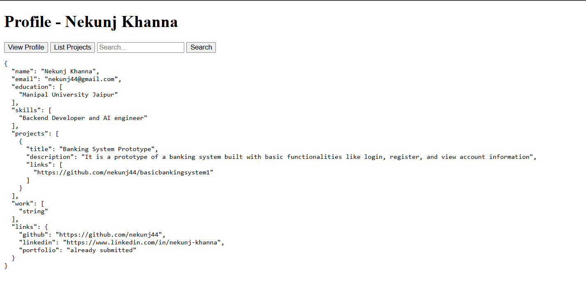
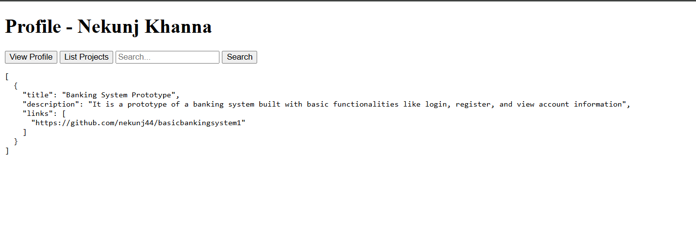

# Me-API Playground: Backend Assessment  

This project is a full-stack application created by **Nekunj Khanna** as part of the backend assessment.  
It features:  
- A personal profile API built with **Python (FastAPI)**  
- A **MongoDB Atlas** database for storage  
- A minimal **vanilla JavaScript frontend** for interaction  
- The entire application is **containerized and deployed** on Render & Netlify  

📄 **Resume Link:** [(https://drive.google.com/file/d/1cBWgF2FpvPKBBMD4_LOAswkbD1kbDgNC/view?usp=sharing)]  

---

## 🚀 Live Application Links  

- **Frontend UI:** [https://classy-daffodil-d51f46.netlify.app/](https://classy-daffodil-d51f46.netlify.app/)  
- **Backend API Base URL:** [https://profile-website-wfph.onrender.com](https://profile-website-wfph.onrender.com)  
- **API Health Check:** [https://profile-website-wfph.onrender.com/health](https://profile-website-wfph.onrender.com/health)  

---

## 🏗️ 1. Architecture and Technology Stack  

This project follows a **monorepo structure**, separating the backend and frontend into distinct directories while maintaining a single source of truth.  

- **Backend Framework:** FastAPI on Python 3.9  
- **Database:** MongoDB Atlas  
- **Frontend:** Vanilla HTML, CSS, and JavaScript (no external libraries/frameworks)  
- **Hosting:**  
  - Backend → Render (Web Service)  
  - Frontend → Netlify (Static Site)  

---

## ✅ 2. Acceptance Criteria Checklist  

- [✅] **GET /health returns 200** → `{"status":"ok"}`  
- [✅] **Queries return correct filtered results** → (`/projects?skill=...`, `/search?q=...`)  
- [✅] **Seed data visible via UI** → frontend fetches and displays data correctly  
- [✅] **README is complete and reproducible**  
- [✅] **URLs load without errors**  

---

## ⚙️ 3. Setup and Running the Project Locally  

### Prerequisites  
- Python 3.9+ and pip  
- Git  
- A MongoDB Atlas account & connection string URI  

---

## 4. Database Schema
- Already Attached to the folder

## 5. Outputs

